# Informações do Projeto
`TÍTULO DO PROJETO`  

MindMate

`CURSO` 

Ciência da Computação

## Participantes

Os membros do grupo são:

- Daniel Victor Rocha Costa
- Felipe Bragança Godinho
- Maria Eduarda Pinto Martins
- Victor Ferraz de Moraes
- Vitor Alexandre Moreira Amaral

# Estrutura do Documento

- [Informações do Projeto](#informações-do-projeto)
  - [Participantes](#participantes)
- [Estrutura do Documento](#estrutura-do-documento)
- [Introdução](#introdução)
  - [Problema](#problema)
  - [Objetivos](#objetivos)
  - [Justificativa](#justificativa)
  - [Público-Alvo](#público-alvo)
- [Especificações do Projeto](#especificações-do-projeto)
  - [Personas, Empatia e Proposta de Valor](#personas-empatia-e-proposta-de-valor)
  - [Histórias de Usuários](#histórias-de-usuários)
  - [Requisitos](#requisitos)
    - [Requisitos Funcionais](#requisitos-funcionais)
    - [Requisitos não Funcionais](#requisitos-não-funcionais)
  - [Restrições](#restrições)
- [Projeto de Interface](#projeto-de-interface)
  - [User Flow](#user-flow)
  - [Wireframes](#wireframes)
- [Metodologia](#metodologia)
  - [Divisão de Papéis](#divisão-de-papéis)
  - [Ferramentas](#ferramentas)
  - [Controle de Versão](#controle-de-versão)
- [**############## SPRINT 1 ACABA AQUI #############**](#-sprint-1-acaba-aqui-)
- [Projeto da Solução](#projeto-da-solução)
  - [Tecnologias Utilizadas](#tecnologias-utilizadas)
  - [Arquitetura da solução](#arquitetura-da-solução)
- [Avaliação da Aplicação](#avaliação-da-aplicação)
  - [Plano de Testes](#plano-de-testes)
  - [Ferramentas de Testes (Opcional)](#ferramentas-de-testes-opcional)
  - [Registros de Testes](#registros-de-testes)
- [Referências](#referências)

# Introdução

## Problema

A falta de ferramentas adequadas para ajudar e tratar pessoas com a doença de Alzheimer é um grande problema. As opções de tratamento atualmente disponíveis são limitadas e muitas vezes inalcançáveis para parte da população. Além disso, o suporte para os cuidadores e familiares desses pacientes também pode ser limitado, levando a altos níveis de estresse e sobrecarga emocional. O que leva a necessidade de criação de um sistema interativo onde os idosos poderão cuidar de sua saúde mental com facilidade e a comodidade de sua casa.

## Objetivos

O objetivo geral deste trabalho é a criação de um aplicativo que melhore a qualidade de vida daqueles com Alzheimer e também daqueles que convivem com os portadores da doença.
Como objetivos específicos, pode-se ressaltar:
Fornecer funcionalidades que permitam canais de comunicação com médicos especializados em saúde do idoso, sobretudo Alzheimer.
Oferecer exercícios cognitivos na forma de jogos virtuais que ajudem a estimular e manter as funções cognitivas, como memória, linguagem, atenção e pensamento abstrato.
Promover rotas de caminho à clínicas e hospitais perto da residência dos usuários.
Fornecer testes de nivelamento da doença, a fim de dar uma noção básica ao paciente, o mesmo, dependendo do resultado poderá procurar, ou não, ajuda profissional. 

## Justificativa

A Organização Mundial da Saúde (OMS) estima que aproximadamente 55 milhões de pessoas vivem com algum tipo de demência. A mais comum é a doença de Alzheimer, que afeta 7 em cada 10 pessoas em todo o mundo. A OMS alerta para uma preocupante tendência ascendente desses números à medida que a população envelhece. A Alzheimer's International, com sede no Reino Unido, estima que os casos globais podem chegar a 74,7 milhões em 2030 e 131,5 milhões em 2050.

Aqui no Brasil, cerca de 1,2 milhão de pessoas contraem a doença a cada ano, segundo dados do Ministério da Saúde, com 100 mil novos diagnósticos. Tais dados preocupantes evidenciam a necessidade de novas técnicas no combate ao agravamento da doença. Logo, o “MindMate” poderia ser uma ferramenta importante nesse combate oferecendo serviços que muitas pessoas no Brasil e no mundo não têm fácil acesso ou conhecimento, acerca das terapias, do acompanhamento médico, dos jogos, etc. 

## Público-Alvo

Pessoas que tenham ou suspeitam que possuem a doença de Alzheimer em seus vários níveis. Além disso, familiares, cuidadores e médicos que, em seu cotidiano, convivem com pessoas com tal enfermidade, também podem aproveitar as várias funcionalidades que o aplicativo pode oferecer.
 
# Especificações do Projeto

## Personas, Empatia e Proposta de Valor

> 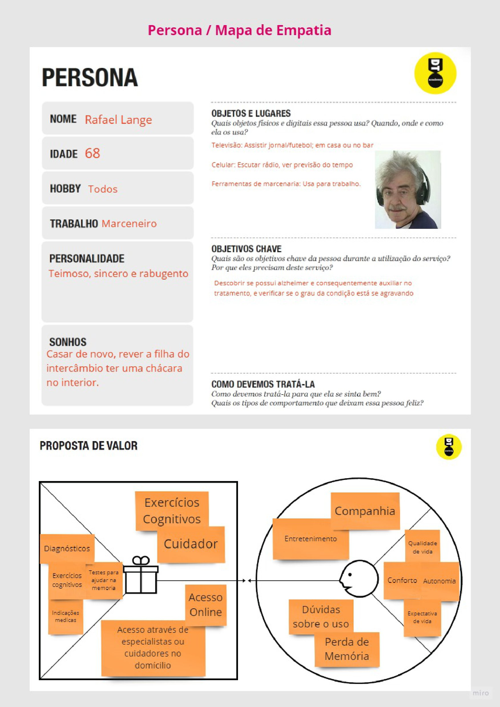

> 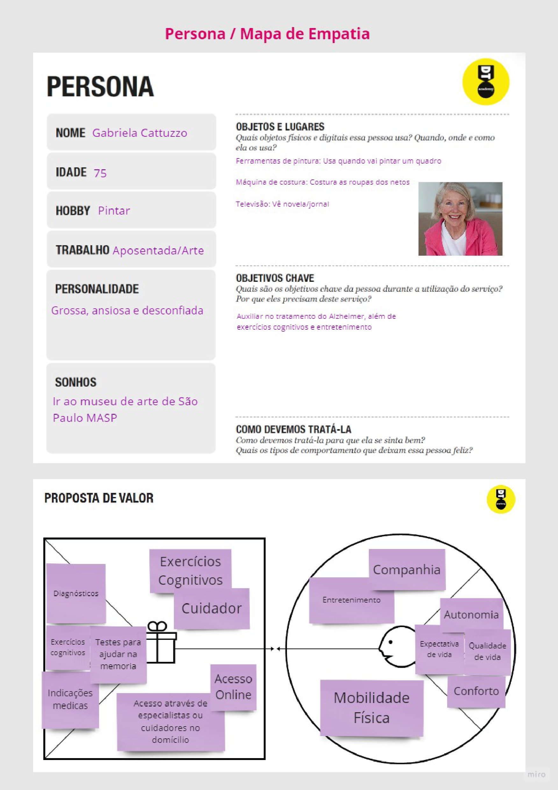

> 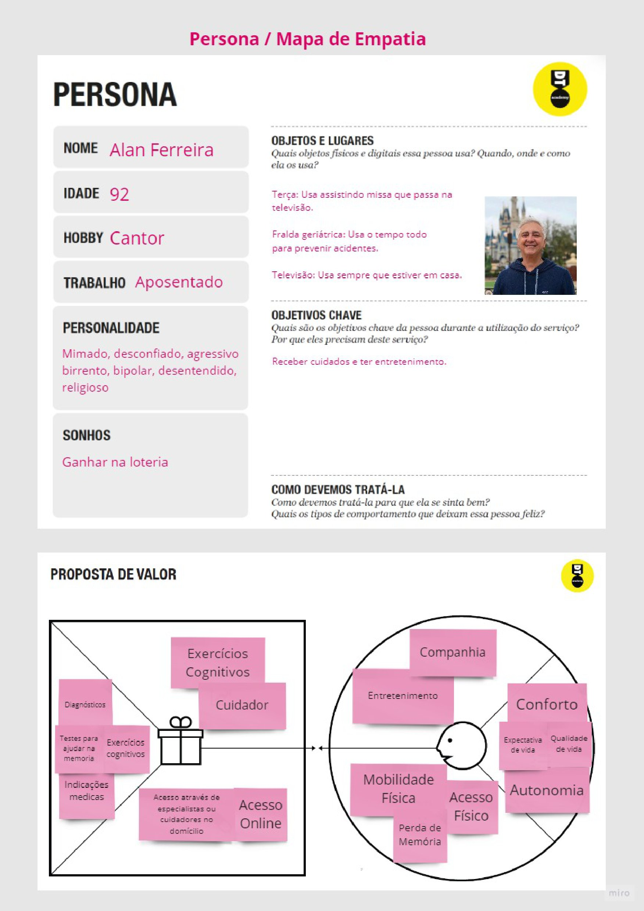

> 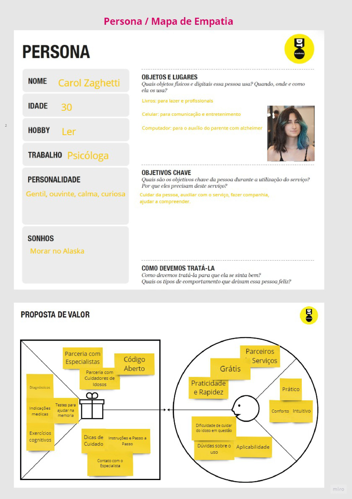

> 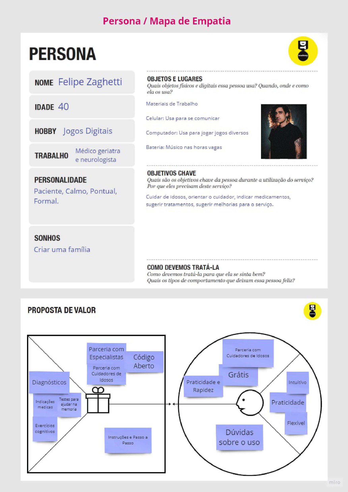

## Histórias de Usuários

Com base na análise das personas forma identificadas as seguintes histórias de usuários:

|EU COMO... `PERSONA`| QUERO/PRECISO ... `FUNCIONALIDADE` |PARA ... `MOTIVO/VALOR`                 |
|--------------------|------------------------------------|----------------------------------------|
|Alan Ferreira       | receber cuidados/entretenimento    | melhora na qualidade de vida           |
|Carol Zaghetti      | Cuidar da pessoa, auxiliar no uso do app, fazer companhia e ajudar a compreender                 | Para ajudar o familiar portador de Alzheimer a ter uma qualidade de vida melhor |
|Felipe Zaghetti     | Cuidar de idosos, orientar o cuidador, indicar medicamentos, sugerir tratamentos e melhorias ao serviço | Ajudar idosos e pessoas com a doença |
|Rafael Lange        | Verificar se possui Alzheimer      | Para auxiliar no tratamento caso o pré-diagnóstico seja positivo |
|Gabriela Cattuzzo   | Ajuda no tratamento do Alzheimer por meios dos exercícios cognitivos | Forma de terapia ocupacional para melhorar a qualidade de vida |

## Requisitos

As tabelas que se seguem apresentam os requisitos funcionais e não funcionais que detalham o escopo do projeto.

### Requisitos Funcionais

|ID    | Descrição do Requisito  | Prioridade |
|------|-----------------------------------------|----|
|RF-001| O aplicativo deve indicar e sugerir medicamentos, profissionais e clínicas que possam ajudar na terapia. | ALTA | 
|RF-002| O aplicativo deve fornecer testes de nivelamento para descobrir o grau de Alzheimer de cada paciente.   | ALTA |
|RF-003| O aplicativo deve oferecer exercícios cognitivos na forma de jogos como forma de terapia ocupacional para cada usuário. | ALTA |
|RF-004| O aplicativo deve fornecer rotas para clínicas e hospitais perto da casa do usuário em casos de emergências. | ALTA |
|RF-005| O aplicativo deve possuir um sistema de chat interativo com os médicos e profissionais da saúde. | MÉDIA |
|RF-006| O aplicativo deve fornecer um guia de ajuda para os usuários. | MÉDIA |
|RF-007| O aplicativo deve ter uma tela para fazer login e cadastro. | MÉDIA |
|RF-008| O aplicativo deve possuir uma interface simples e de fácil uso. | BAIXA |
|RF-009| O aplicativo deve possuir um sistema de notificação funcional para os usuários. | BAIXA |
|RF-010| O aplicativo deve possuir uma área de edição de perfil para fotos, nome e senha. | BAIXA |

### Requisitos não Funcionais

|ID     | Descrição do Requisito  |Prioridade |
|-------|-------------------------|----|
|RNF-001| O site deve ser publicado em um ambiente acessível publicamente na Internet (Repl.it, GitHub Pages, Heroku);  | ALTA | 
|RNF-002| O site deverá ser responsivo permitindo a visualização em um celular de forma adequada |  ALTA |
|RNF-003| O site deve ter bom nível de contraste entre os elementos da tela em conformidade  |  MÉDIA |
|RNF-004| O site deve ser compatível com os principais navegadores do mercado (Google Chrome, Firefox, Microsoft Edge) |  ALTA |

## Restrições

O projeto está restrito pelos itens apresentados na tabela a seguir.

|ID| Restrição                                             |
|--|-------------------------------------------------------|
|01| O projeto deverá ser entregue até o final do semestre |
|02| Não pode ser desenvolvido um módulo de backend        |
|03| A equipe não pode subcontratar o desenvolvimento do trabalho. |

# Projeto de Interface

Dentre as preocupações para a montagem da interface do sistema, estamos estabelecendo foco em questões como agilidade, acessibilidade e usabilidade. Desta forma, o projeto tem uma identidade visual padronizada em todas as telas que são projetadas para funcionamento em desktops e dispositivos móveis.

## User Flow

> 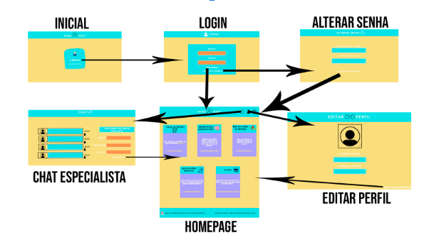

## Wireframes

> 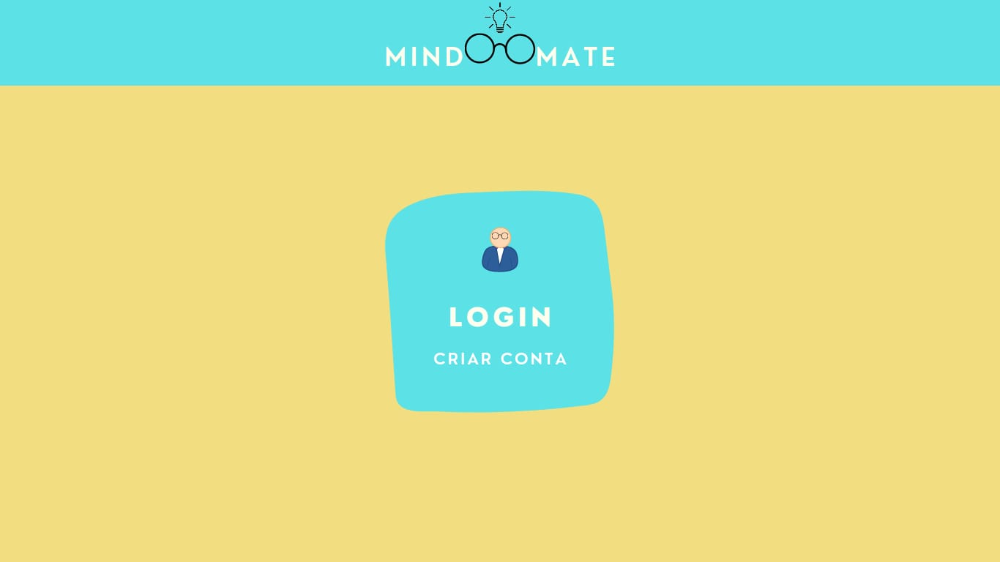

> 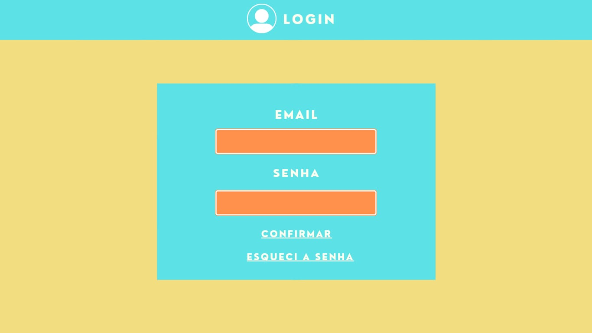

> 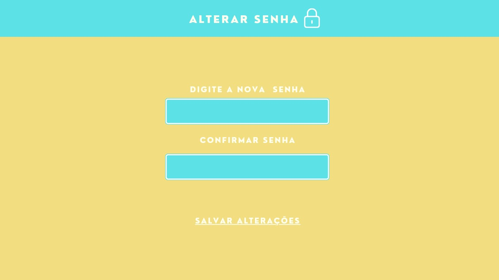

> 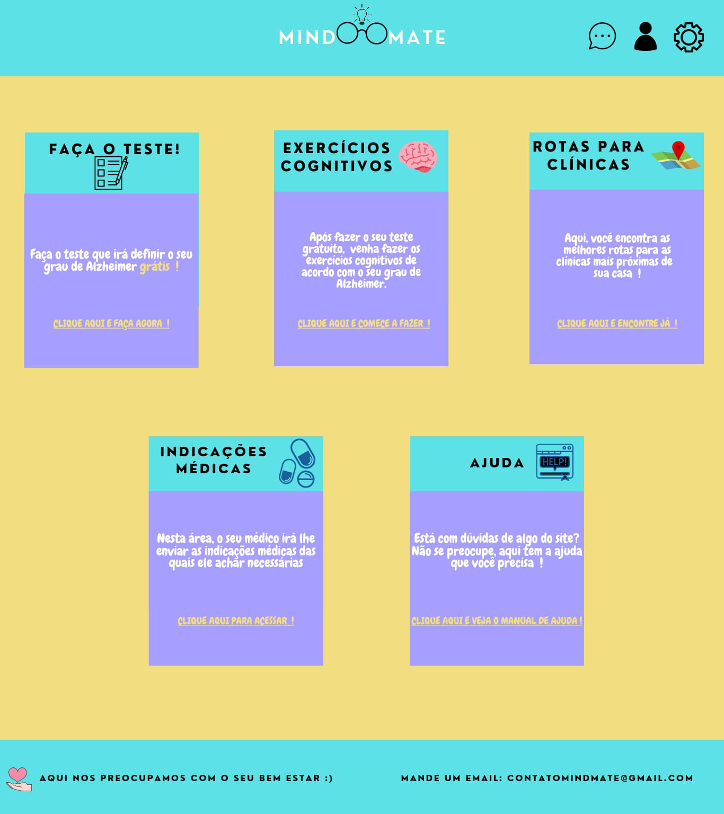

> 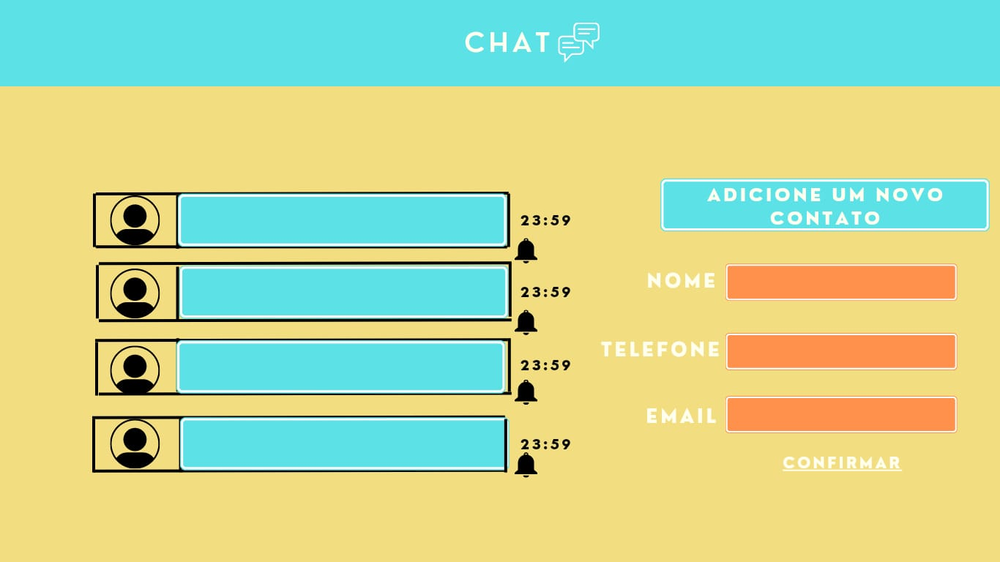

> 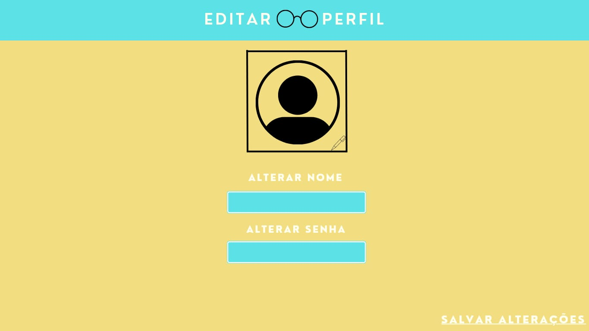

# Metodologia

A metodologia contempla as definições de ferramental utilizado pela equipe tanto para a manutenção dos códigos e demais artefatos quanto para a organização do time na execução das tarefas do projeto.

## Divisão de Papéis

A equipe utiliza metodologias ágeis, tendo escolhido o Scrum como base para definição do processo de desenvolvimento.

A equipe está organizada da seguinte maneira:
- Scrum Master: Ilo Amy Saldanha Rivero
- Product Owner: Ilo Amy Saldanha Rivero
- Equipe de Desenvolvimento
- Daniel Victor Rocha Costa (Desenvolvedor Front End)
- Felipe Bragança Godinho  (Designer) 
- Maria Eduarda Pinto Martins (Desenvolvedor Front End, Analista de Negócios)
- Victor Ferraz de Moraes (Desenvolvedor Back End)
- Vitor Alexandre Moreira Amaral (Desenvolvedor Front End)

## Ferramentas

Os artefatos do projeto são desenvolvidos a partir de diversas plataformas e a relação dos ambientes com seu respectivo propósito é apresentada na tabela que se segue.

| Ambiente  | Plataforma              |Link de Acesso |
|-----------|-------------------------|---------------|
|Processo de Design Thinkgin  | Miro |  https://miro.com/app/board/uXjVMT7eBnU=/ | 
|Repositório de código | GitHub | https://github.com/ICEI-PUC-Minas-PMGCC-TI/ti-1-pmg-cc-m-20231-tiaw-mindmate | 
|Hospedagem do site | Heroku |  https://XXXXXXX.herokuapp.com | 
|Protótipo Interativo | MavelApp | https://marvelapp.com/prototype/9g597ab |

## Controle de Versão

Para gestão do código fonte do software desenvolvido pela equipe, o grupo utiliza um processo baseado no Git Feature Branch Workflow, mostrado na Figura a seguir. Desta forma, todas as manutenções no código são realizadas em branches separadas. Uma explicação rápida sobre este processo é apresentada no site "5 Git Workflows & Branching Strategy to deliver better code".

> 

# **############## SPRINT 1 ACABA AQUI #############**

# Projeto da Solução

......  COLOQUE AQUI O SEU TEXTO ......

## Tecnologias Utilizadas

......  COLOQUE AQUI O SEU TEXTO ......

> Descreva aqui qual(is) tecnologias você vai usar para resolver o seu
> problema, ou seja, implementar a sua solução. Liste todas as
> tecnologias envolvidas, linguagens a serem utilizadas, serviços web,
> frameworks, bibliotecas, IDEs de desenvolvimento, e ferramentas.
> Apresente também uma figura explicando como as tecnologias estão
> relacionadas ou como uma interação do usuário com o sistema vai ser
> conduzida, por onde ela passa até retornar uma resposta ao usuário.
> 
> Inclua os diagramas de User Flow, esboços criados pelo grupo
> (stoyboards), além dos protótipos de telas (wireframes). Descreva cada
> item textualmente comentando e complementando o que está apresentado
> nas imagens.

## Arquitetura da solução

......  COLOQUE AQUI O SEU TEXTO E O DIAGRAMA DE ARQUITETURA .......

> Inclua um diagrama da solução e descreva os módulos e as tecnologias
> que fazem parte da solução. Discorra sobre o diagrama.
> 
> **Exemplo do diagrama de Arquitetura**:
> 
> 

# Avaliação da Aplicação

......  COLOQUE AQUI O SEU TEXTO ......

> Apresente os cenários de testes utilizados na realização dos testes da
> sua aplicação. Escolha cenários de testes que demonstrem os requisitos
> sendo satisfeitos.

## Plano de Testes

......  COLOQUE AQUI O SEU TEXTO ......

> Enumere quais cenários de testes foram selecionados para teste. Neste
> tópico o grupo deve detalhar quais funcionalidades avaliadas, o grupo
> de usuários que foi escolhido para participar do teste e as
> ferramentas utilizadas.
> 
> **Links Úteis**:
> - [IBM - Criação e Geração de Planos de Teste](https://www.ibm.com/developerworks/br/local/rational/criacao_geracao_planos_testes_software/index.html)
> - [Práticas e Técnicas de Testes Ágeis](http://assiste.serpro.gov.br/serproagil/Apresenta/slides.pdf)
> -  [Teste de Software: Conceitos e tipos de testes](https://blog.onedaytesting.com.br/teste-de-software/)

## Ferramentas de Testes (Opcional)

......  COLOQUE AQUI O SEU TEXTO ......

> Comente sobre as ferramentas de testes utilizadas.
> 
> **Links Úteis**:
> - [Ferramentas de Test para Java Script](https://geekflare.com/javascript-unit-testing/)
> - [UX Tools](https://uxdesign.cc/ux-user-research-and-user-testing-tools-2d339d379dc7)

## Registros de Testes

......  COLOQUE AQUI O SEU TEXTO ......

> Discorra sobre os resultados do teste. Ressaltando pontos fortes e
> fracos identificados na solução. Comente como o grupo pretende atacar
> esses pontos nas próximas iterações. Apresente as falhas detectadas e
> as melhorias geradas a partir dos resultados obtidos nos testes.

# Referências

......  COLOQUE AQUI O SEU TEXTO ......

> Inclua todas as referências (livros, artigos, sites, etc) utilizados
> no desenvolvimento do trabalho.
> 
> **Links Úteis**:
> - [Formato ABNT](https://www.normastecnicas.com/abnt/trabalhos-academicos/referencias/)
> - [Referências Bibliográficas da ABNT](https://comunidade.rockcontent.com/referencia-bibliografica-abnt/)
